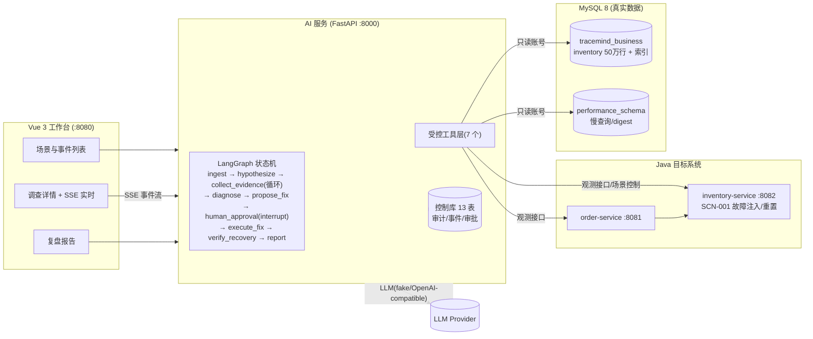

# TraceMind

面向微服务系统的 **AI 故障诊断与安全处置平台**:当微服务出现性能故障时,AI Agent 基于真实证据(MySQL 慢查询、执行计划、索引元数据、接口 P95)自动完成 **根因定位 → 修复方案 → 人工审批 → 自动修复 → 恢复验证 → 复盘报告** 的完整闭环,全程可审计、可回放。

> 简历作品集项目 · 证据驱动的根因判定 + 人机协同的安全闭环 + 全链路审计

---

## 架构总览



### 关键设计

- **证据驱动的根因判定(E1~E5 闸门)**:接口 P95 异常 → trace 定位到数据库阶段 → 慢查询 digest 增量 → `EXPLAIN` 全表扫描 → 索引元数据缺失,**五项证据齐备才确认根因**,缺证据继续调查或转人工。
- **人机协同的安全闭环**:Agent 只有只读调查能力;唯一写路径 `execute_fix`(预定义 DDL,六项校验)必须经过 `interrupt()` 挂起的**人工审批**,支持过期自动拒绝。
- **受控工具层**:7 个工具,LLM 只能绑定 5 个只读调查工具;四账号隔离(业务读写 / 控制库 / 只读调查 / 仅 INDEX),Python 侧三连接池。
- **全链路审计与回放**:每次工具调用、状态变化、审批决策全部落库,SSE 事件流按 `Last-Event-ID` 断线补发,复盘报告基于已落库事实生成。
- **真实数据而非模拟**:50 万行库存数据、真实 MySQL 执行计划、真实 P95;故障由可逆的"删除/重建联合索引"注入。

---

## 快速开始

### 方式一:Docker Compose 一键启动(推荐)

需要 Docker 24+ 与 Docker Compose v2。

```bash
docker compose up -d --build     # 首次构建 10~20 分钟
docker compose ps                # 等待全部 healthy
```

启动后访问:

| 服务 | 地址 |
|---|---|
| 前端工作台 | http://localhost:8080 |
| AI 服务 API | http://localhost:8000/api/health |
| order-service | http://localhost:8081/actuator/health |
| inventory-service | http://localhost:8082/actuator/health |
| MySQL | localhost:3306(root/root_pwd_2026) |

> 首次启动会自动初始化数据库(建库/四账号/业务表/控制库 13 表)并灌入 50 万行压测数据(幂等,已有数据则跳过)。

### 方式二:本地开发环境

依赖:JDK 21、Maven、Python 3.12+、Node 22+、MySQL 8(本地),详见 `docs/architecture.md`。

```bash
# 1) 初始化数据库(需 root 密码)
export MYSQL_ROOT_PASSWORD=<你的root密码>
powershell -ExecutionPolicy Bypass -File scripts/init-database.ps1

# 2) 灌入压测数据
powershell -ExecutionPolicy Bypass -File scripts/generate-data.ps1

# 3) 启动 Java 服务(inventory 需 DEMO_MODE)
cd java/inventory-service && mvn spring-boot:run   # :8082,DEMO_MODE=true DEMO_KEY=demo-secret-2026
cd java/order-service && mvn spring-boot:run        # :8081

# 4) 启动 AI 服务
cd ai-service && uv run uvicorn app.main:app --port 8000   # TRACEMIND_DEMO_MODE=true TRACEMIND_DEMO_KEY=demo-secret-2026

# 5) 启动前端
cd web && npm install && npm run dev                # http://localhost:5173
```

---

## 演示流程(5 分钟)

1. 打开工作台 →「重置环境」(恢复健康基线)。
2. 点击「注入故障」→ inventory-service 的联合索引被删除。
3. 创建 Incident →「开始调查」:详情页通过 SSE 实时看到 Agent 的假设、证据采集(E1~E5)、状态流转。
4. 到达 `awaiting_approval`:检查修复方案(动作/风险/参数),点击「批准」。
5. 自动执行修复 → 恢复验证 → 状态 `recovered`。
6. 打开「复盘报告」:根因、证据链、修复与恢复结论。

命令行一键演示(完整闭环,约 15s):

```bash
python scripts/verify-m3.py        # 本地服务运行时
# 或 Docker 环境:
python scripts/verify-m5.py --base http://localhost:8000
```

---

## 目录结构

```
java/                 # Maven 多模块:common / order-service / inventory-service
ai-service/           # FastAPI + LangGraph + SQLAlchemy 三连接池
web/                  # Vue3 + TS + Vite + Element Plus 工作台
scripts/              # 初始化/灌数/负载/验收脚本
scripts/sql/          # 建库/四账号/DDL(compose initdb 复用)
docs/                 # 架构文档与演示脚本
docker-compose.yml    # 一键编排
```

## 测试

```bash
cd java && mvn test               # JUnit5 + Mockito(单元)
cd java && mvn verify             # 追加 Testcontainers MySQL 集成测试(需 Docker,EXPLAIN 断言走索引)
cd ai-service && uv run pytest    # Agent 图/工具/API(pytest,49+)
cd web && npx vitest run          # Vue 组件/组合式函数
npx playwright test               # 浏览器 E2E 冒烟(演示闭环,需全栈运行)
python scripts/verify-m5.py --base http://localhost:8000   # Docker 部署端到端验收
```

## 技术栈

Java 21 / Spring Boot 3.3 / MyBatis-Plus · FastAPI / LangGraph / SQLAlchemy 2.0 / LangChain · Vue 3 / TypeScript / Vite / Element Plus · MySQL 8 / performance_schema · Docker Compose · SSE

## 简历亮点

- 用 LangGraph 状态机编排**证据驱动**的诊断流程,以 E1~E5 事实闸门替代 LLM 猜测式根因,消除幻觉。
- 将**人工审批(human-in-the-loop)**嵌入 Agent 状态机,唯一写路径 + 六项前置校验 + 过期自动拒绝,形成可对外宣讲的安全闭环。
- 工具层以**最小权限隔离**落地(四账号/三连接池/白名单参数),每次工具调用与决策全量审计,支持复盘回放。
- 所有证据来自**真实系统**:MySQL 执行计划、performance_schema 慢查询、真实 P95 指标,演示可重复、可量化。
