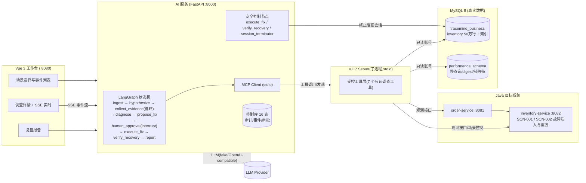

# TraceMind

面向微服务系统的 **AI 故障诊断与安全处置平台**:当微服务出现性能故障时,AI Agent 基于真实证据(MySQL 慢查询、执行计划、索引元数据、接口 P95、锁等待关系)自动完成 **根因定位 → 修复方案 → 人工审批 → 自动修复 → 恢复验证 → 复盘报告** 的完整闭环,全程可审计、可回放。支持**多故障场景**(SCN-001 缺索引 / SCN-002 锁等待)与**回归评测流水线**。

> 简历作品集项目 · 证据驱动的根因判定 + 人机协同的安全闭环 + 全链路审计

---

## 架构总览



### 关键设计

- **证据驱动的根因判定(双 Policy 闸门)**:SCN-001 缺索引走 E1~E5(接口 P95 → trace 定位数据库阶段 → 慢查询 digest → `EXPLAIN` 全表扫描 → 索引元数据缺失);SCN-002 锁等待走 L1~L6(锁等待关系 → 阻塞事务详情 → 阻塞者匹配 → 长事务 → 复合匹配 → 会话状态)。共享 Fact 派生双 Policy 状态(confirmed/refuted/unknown/stale),**证据齐备才确认根因**,证据矛盾或预算耗尽转人工。
- **人机协同的安全闭环**:Agent 只有只读调查能力;唯一写路径 `execute_fix`(预定义 DDL,六项校验)必须经过 `interrupt()` 挂起的**人工审批**,支持过期自动拒绝;锁场景处置 `TERMINATE_BLOCKING_SESSION` 经**会话终止执行器**(KILL 前复核:目标关系未变、仍持锁、账号白名单、非系统线程),负例零误杀、幂等防重复处置。
- **受控工具层(MCP 化)**:7 个只读调查工具封装为 **stdio MCP Server**(官方 SDK),LangGraph 通过持久化 MCP Client 完成工具发现与调用,消除进程内 direct 路径;`execute_fix` / `verify_recovery` 属确定性安全控制节点,不纳入 MCP。五账号隔离(业务读写 / 控制库 / 只读调查 / 仅 INDEX / 会话终止),Python 侧三连接池。
- **全链路审计与回放**:每次工具调用(含 transport / MCP 调用标识)、状态变化、审批决策、模型调用、知识检索全部落库,SSE 事件流按 `Last-Event-ID` 断线补发,复盘报告基于已落库事实生成。
- **真实数据而非模拟**:50 万行库存数据、真实 MySQL 执行计划与锁等待关系、真实 P95;故障由可逆的"删除/重建联合索引"与"后台长事务持锁/回滚"注入。

---

## 快速开始

### 方式一:Docker Compose 一键启动(推荐)

```bash
docker compose up -d --build    # MySQL(自动 initdb)+ seed(灌 50 万行)+ order + inventory + ai + web
docker compose ps               # 全部 healthy 后开始使用
```

工作台 `http://localhost:8080`;默认 `TRACEMIND_LLM_MODE=fake`(确定性回归可复现),真实模型验收见 V1.1 章节。

### 方式二:本地开发环境

```bash
# 1) 初始化数据库(需 root 密码)
powershell -ExecutionPolicy Bypass -File scripts/init-database.ps1
# 2) 灌入压测数据
powershell -ExecutionPolicy Bypass -File scripts/generate-data.ps1
# 3) 启动 Java 服务(inventory 需 DEMO_MODE)
java -jar order-service/target/order-service-0.1.0-SNAPSHOT.jar
DEMO_MODE=true DEMO_KEY=demo-secret-2026 java -jar inventory-service/target/inventory-service-0.1.0-SNAPSHOT.jar
# 4) 启动 AI 服务
cd ai-service && uv run uvicorn app.main:app --port 8000
# 5) 启动前端
cd web && npm run dev
```

## 演示流程(5 分钟)

### SCN-001:库存查询慢(缺联合索引)

```bash
python scripts/verify-m5.py --base http://localhost:8000 --order http://localhost:8081
```

自动执行:重置 → 健康负载 → 基线 → 注入故障(DROP INDEX)→ 调查(E1~E5 证据)→ 审批 → 建索引 → 恢复验证 → 复盘报告。

### SCN-002:库存预占超时(长事务持锁)

```bash
python scripts/verify-m13-scn002.py --base http://localhost:8000
```

自动执行:重置 → 健康负载 → 注入锁故障(后台长事务 `FOR UPDATE` 持锁 42/7)→ 调查(L1~L6 锁证据)→ 审批 → **KILL 阻塞会话** → 恢复验证 → 复盘报告。负载与锁验证并发执行,验证 `FOR SHARE` 被阻塞的真实锁等待。

前端工作台可切换场景、注入/重置故障、查看实时调查进度与审批。

## 目录结构

```
java/                 # Maven 多模块:common / order-service / inventory-service
ai-service/           # FastAPI + LangGraph + MCP Client + SQLAlchemy 三连接池
web/                  # Vue3 + TS + Vite + Element Plus 工作台
knowledge/runbooks/   # RAG 知识库(慢 SQL / 锁等待手册)
data/eval_cases/      # 离线评测 Fixture(24 条)
scripts/              # 初始化/灌数/负载/验收/评测脚本
scripts/sql/          # 建库/五账号/DDL/版本化迁移
reports/regression/   # 回归评测报告
docs/                 # 设计文档与实施计划
compose.yml           # 一键编排(基底,CI/本地/VM 统一)
```

## 测试与验收

```bash
cd java && mvn test               # JUnit5 + Mockito(单元)
cd java && mvn verify             # 追加 Testcontainers MySQL 集成测试(需 Docker,EXPLAIN 断言走索引)
cd ai-service && uv run pytest    # Agent 图/工具/MCP/API(179)
cd web && npx vitest run          # Vue 组件/组合式函数(18)
npx playwright test               # 浏览器 E2E 冒烟(演示闭环,需全栈运行)
python scripts/verify-m5.py --base http://localhost:8000           # SCN-001 全链路
python scripts/verify-m13-scn002.py --base http://localhost:8000   # SCN-002 全链路
python scripts/eval_agent.py --mode offline --llm fake --runs 1    # 24 条离线评测(fake)
python scripts/run_regression.py --tier fast                          # 回归流水线 fast 档
```

## 技术栈

Java 21 / Spring Boot 3.3 / MyBatis-Plus · FastAPI / LangGraph / MCP(官方 Python SDK)/ SQLAlchemy 2.0 · Vue 3 / TypeScript / Vite / Element Plus · MySQL 8 / performance_schema / information_schema · Qdrant(embedding 向量检索)· Docker Compose · SSE

## 简历亮点

- 用 LangGraph 状态机编排**证据驱动**的诊断流程,以 E1~E5 / L1~L6 事实闸门替代 LLM 猜测式根因,消除幻觉;双 Diagnostic Policy 支持**多故障场景**(缺索引、锁等待)与冲突检测。
- 将**人工审批(human-in-the-loop)**嵌入 Agent 状态机,唯一写路径 + 前置校验 + 过期自动拒绝;**锁场景处置**对 KILL 做执行前复核(目标未变 / 仍持锁 / 账号白名单),负例零误杀,形成可对外宣讲的安全闭环。
- 工具层以 **MCP 协议标准化**(stdio,7 只读工具),与**最小权限隔离**落地(五账号/三连接池/白名单参数),每次工具调用与决策全量审计,支持复盘回放。
- 所有证据来自**真实系统**:MySQL 执行计划、performance_schema 慢查询与锁等待、真实 P95 指标,演示可重复、可量化;自带 24 条离线评测与 fast/full 回归流水线。

## V1.1:真实 LLM + Tool Calling + RAG + 评测体系

### 三模式 LLM

| 模式 | 行为 | 用途 |
|---|---|---|
| `TRACEMIND_LLM_MODE=fake` | FakeLLM(确定性,不触网) | 测试 / CI / 显式回归 |
| `real_strict` | 模型失败即转 needs_human,禁止降级 | 正式评测 / 验收 |
| `real_demo` | 模型失败降级到确定性组件并标记 `degraded` | 演示兜底 |

真实模型走 OpenAI 兼容端点(百炼),`hypothesize` 用结构化输出(容忍 markdown fence),
工具选择走 **真实 Tool Calling**(`collect_evidence` 混合循环:LLM 选工具 → 程序校验/白名单/去重/预算),
`propose_fix` 完全确定性(`FixRegistry`,零 LLM 调用,参数 hash 固定)。

### RAG 知识库

- 10 篇 Runbook(`knowledge/runbooks/`,frontmatter 元数据)经 embedding 写入 Qdrant(Collection Alias + 读写 Key 分离)。
- 入库:`cd ai-service && uv run python ../scripts/seed_runbook.py [--recreate]`(幂等)。
- `hypothesize` 检索 top-k 片段注入 prompt(指令隔离:知识参考不可被当作指令执行),并写 `retrieval_record` 审计。
- 失败降级:检索失败 → `rag_degraded` 事件 → 无知识上下文继续,`TRACEMIND_RAG_MODE=required` 时该次验收判失败。

### 真实模型验收(显式切换)

```bash
# compose 环境:TRACEMIND_LLM_MODE=real_strict + TRACEMIND_RAG_MODE=required + 启动 qdrant 服务
TRACEMIND_LLM_MODE=real_strict TRACEMIND_EVAL_MODE=true \
  uv run python ../scripts/eval_agent.py --mode offline --llm real_strict --runs 3   # 真实模型离线评测
uv run python ../scripts/smoke_llm.py               # 真实模型冒烟(Structured Output + Tool Calling,禁止假通过)
# e2e-scn001-real:全栈真实模型 3 轮闭环(需百炼额度,见 tracemind-real-model-quota)
```

## V1.2:MCP 工具服务(stdio)

将只读调查工具封装为基于官方 SDK 的 **stdio MCP Server**(V1.3 后为 7 个)。LangGraph Agent 通过持久化 MCP Client 会话完成工具发现和调用,**消除调查工具进程内 direct 路径**;`execute_fix` / `verify_recovery` 属确定性安全控制节点,不纳入 MCP。

- **生命周期**:FastAPI lifespan 启动时 spawn MCP Server → initialize → 契约校验(serverInfo / 工具集合 / inputSchema 签名)→ readiness;关闭时有序终止;启动失败即应用启动失败
- **上下文注入**:`incident_id` / `agent_run_id` 由 MCP Client 注入,LLM 侧 Schema 隐藏,仅审计
- **审计**:`tool_call` 表新增 `agent_run_id` / `transport`(`mcp_stdio` / `internal_control` / `legacy_direct`)/ `mcp_invocation_id` / `mcp_attempt`(版本化迁移 `scripts/sql/05-v12-mcp-migration.sql`)
- **错误码**:`MCP_START_FAILED / MCP_SCHEMA_MISMATCH / MCP_TIMEOUT / MCP_DISCONNECTED / MCP_PROTOCOL_ERROR / MCP_TOOL_ERROR / MCP_RESULT_INVALID`;业务失败保留原始 error_code;重启最多一次,不降级 direct
- **测试**:协议集成(真实 stdio + stdout 纯净)、故障注入(主动终止不 direct fallback)、全栈回归断言 `transport=mcp_stdio`

## V1.3:多故障场景(SCN-002 锁等待)+ 回归评测流水线

### 场景与双 Policy

| 场景 | 故障注入 | 证据链 | 根因 | 处置动作 |
|---|---|---|---|---|
| SCN-001 | 删除联合索引 | E1~E5 | `MISSING_INVENTORY_INDEX` | `CREATE_INVENTORY_INDEX`(审批后建索引) |
| SCN-002 | 后台长事务 `FOR UPDATE` 持锁 42/7 | L1~L6 | `LONG_RUNNING_TRANSACTION_BLOCKING_INVENTORY_RESERVATION` | `TERMINATE_BLOCKING_SESSION`(KILL 阻塞会话) |

- **共享 Fact 层**(8 个布尔)派生双 Policy 状态;诊断按四分支判定:单根因确认 / 多根因冲突 / 全部否定 / 证据不足;`X-NO-TARGET-LOCK-WAIT` 为可排除项(已采且无锁等待即排除锁根因)。
- **锁调查工具**:`get_lock_waiters`(performance_schema `data_lock_waits` + `data_locks` + `threads` 真实查询)与 `get_transaction_details`(`innodb_trx`),`blocker_ref = blk_<processlist_id>` 桥接两个 ID 空间。
- **处置安全(session_terminator)**:第五账号(KILL 前复核:审批有效未过期、`blocking_transaction_id` 一致、仍持锁、账号白名单、非系统线程),幂等防重复处置;`blocking_relation_hash`(10 项稳定身份,不含时间)固化审批与执行目标。
- **观测语义**:`get_service_metrics` 空窗口(P95 null)视为"未采集"允许重采;锁等待期间查询耗时集中数据库阶段(即使超时也记录),保证证据链在真实故障下成立。
- **恢复验证**:锁场景按目标范围(索引存在 / 计划走索引 / 无锁等待 / 阻塞会话已终止 / P95 相对基线)轮询验证,超时 `recovery_timeout` 转人工。

### 回归评测流水线

```bash
python scripts/run_regression.py --tier fast    # fast 档:单测 + 离线评测 + 处置安全(分钟级,不依赖外部服务)
python scripts/run_regression.py --tier full    # full 档:fast + SCN-001/SCN-002 全链路 E2E(需全栈)
```

- 报告写入 `reports/regression/`,记录 Git SHA / 版本 / 各阶段耗时 / 失败原因,失败时非零退出码(CI 可拦截)。
- 24 条离线评测 Fixture(16 索引 + 8 锁,动态 N/N)+ 处置安全套件(合法 KILL 恰一次 / 未审批禁 KILL / 负例零误杀)。
- 关键回归项:`p95 null 不产 E1 证据且允许重采`、`已采集证据不重采`、`双 Policy 四分支`、`transport 全 mcp_stdio 无 direct`。

### 配置表(V1.3 新增)

`TRACEMIND_SESSION_TERMINATOR_DB_URL`(会话终止专用账号,无 database)· `TRACEMIND_RECOVERY_TIMEOUT`(恢复轮询超时,默认 60s)

## V1.4:真实可观测性(Prometheus + Jaeger + OTel)

### 观测架构

```
Java(OTel Agent 2.12.0,管理端口 9081/9082)
  ├─ Trace: OTLP/gRPC → otel-collector(trace-only) → jaeger(内存存储)
  └─ Metrics: Micrometer Prometheus 端点 → prometheus → grafana
ai-service(TRACEMIND_METRICS_BACKEND / TRACE_BACKEND 切换)
  ├─ get_service_metrics → PrometheusMetricsClient(固定 PromQL 模板注册表,新鲜度判定)
  └─ get_trace → JaegerTraceClient(HTTP JSON API)+ TraceNormalizer(TRACE_NORMALIZER_V1)
```

- **证据语义**:E1 证据含 `sourceBackend/observationQueryId/windowStart/windowEnd/latestSampleAt`;E2 证据含 `dbDominanceRatio`(数据库阶段占比 ≥0.5)+ `traceId`(Jaeger 可再查)。get_trace 由**异常时间窗口**驱动(planner 经 `trace_ref=REPRESENTATIVE_SLOW_TRACE` 抽象引用解析)。
- **观测审计**:`observation_query` 表记录每次查询(backend/template_id/状态/耗时/结果哈希/归一化结果),不存原始 Prometheus/Jaeger 响应。
- **不回退 internal**:`full` 回归档强制 `metrics_backend=prometheus + trace_backend=jaeger`;Prometheus/Jaeger 停止时工具返回 `METRICS_BACKEND_UNAVAILABLE` / `TRACE_BACKEND_UNAVAILABLE`,调查明确失败,绝不回落旧内部观测。
- **compose 网络分区**:`tracemind`(业务)/ `metrics-scrape-net`(Java→Prometheus)/ `trace-ingest-net`(Java→Collector→Jaeger)/ `observability-query-net`(AI/Grafana→Prometheus/Jaeger);Grafana/Jaeger UI 仅宿主机回环 + `observability-ui` profile。

### 验证命令(V1.4)

```bash
# 本地 fixture 冒烟(不需要 Prometheus/Jaeger)
python scripts/verify-m14.py --base http://localhost:8000 --order http://localhost:8081 --fixture --rounds 1
# VM 全量验收(全栈 + 观测栈;要求 metrics_backend=prometheus + trace_backend=jaeger)
python scripts/verify-m14.py --base http://<vm-host>:8000 --order http://<vm-host>:8081
python scripts/verify-observability-resilience.py --base http://<vm-host>:8000
python scripts/verify-grafana-smoke.py --grafana http://127.0.0.1:3000
python scripts/run_regression.py --tier full   # full 档强制真实后端
```

## V1.5:证据与决策链回放(Replay)

### 回放架构

```
调查时写入(不可变快照)                   读取时投影(只读,零副作用)
Agent 节点执行 → ReplayWriter           Replay API(按 Run 限定)
  └─ incident_replay_step(纯追加)  →     Replay Projector → Manifest/steps
       logical_step_id × attempt_no        stepIndex/displayDurationMs/keyStepIndexes
       phase: started → completed/failed   runOutcome/terminationReason
前端 ReplayView(本地播放,不重算 Policy)
  └─ position 语义(状态位置)/ 单次 setTimeout / 状态机 / 控制条
```

- **不可变证据**:`incident_replay_step` 纯追加、禁 UPDATE/DELETE;`sequence_no` 原子分配与插入同事务;每步含 `snapshotHash`(Canonical JSON SHA-256,一致性校验,非防篡改)与 `source_reference`(引用不可变版本 + 冻结摘要,不塞原始响应)。
- **两段式 phase**:同 `logical_step_id` 先 `started` 后 `completed|failed`;按 `(logical_step_id, attempt_no)` 组装 Attempt(重试/审批拒绝→新 Attempt);`RUN_TERMINATED` 记录 `runOutcome`(recovered/failed/rejected/needs_human)与 `terminationReason`。
- **只读 API**:`GET /api/incidents/{id}/replay`、`/replay/runs/{run_id}`、`/steps`、`/steps/{logical_step_id}`;不触发状态机、不调 LLM/MCP、不执行审批处置、不重算 Policy;`asOfSequenceNo` 保证 Manifest 与 steps 同一截面;runId 归属校验 404。
- **版本冻结与校验**:Run 启动时冻结 `expected_*` 版本常量,Step 记录实际使用版本;恢复 Run 前校验不一致 → `version_mismatch`,停止原 Run 不按当前程序补算。
- **前端回放页**:`web/src/views/ReplayView.vue` + `useReplayPlayback`(position 状态语义、状态机、倍速、跳转暂停);`partial` 时展示缺失部分,绝不按当前 Policy 补算;只读横幅提示"不会执行任何系统操作"。

### 验证命令(V1.5)

```bash
# 本地 fixture 验收(需本地 MySQL + 三个服务已启动)
python scripts/verify-m15.py --base http://localhost:8000 --order http://localhost:8081
# VM 全栈验收(代码同步 + 镜像重建后执行;--order 的 host 自动作为 pymysql 直连地址)
python scripts/verify-m15.py --base http://<vm-host>:8000 --order http://<vm-host>:8081
```

- 断言内容:SCN-002 完整闭环 → `replayStatus=complete` + 11 类必需步骤 + `runOutcome=recovered`;rejected 路径 → `runOutcome=rejected` 且不要求 `FIX_EXECUTED`;只读无副作用(重复读取一致 / runId 归属 404)。
- **部署注意**:compose 部署下 ai-service 必须配 `TRACEMIND_SESSION_TERMINATOR_DB_URL`(缺省时处置 KILL 回退只读账号报 500),本地直接跑 python 用 `.env.local` 不受影响。

## V1.6:CI 化回归与评测流水线(GitHub Actions)

### Fast 持续门禁 + Full 手动发布验收

```
Fast(fast-gate.yml,每次 PR/main push)          Full(full-e2e.yml,手动触发)
├─ python-tests(MySQL service, ci_db profile)   ├─ preflight(无 Secret,ref/SemVer/祖先校验)
├─ java-tests(MySQL service, surefire)          ├─ verify-fast-gate(Check Run 校验)
├─ web-tests(typecheck + vitest + build)        └─ full-e2e(Environment Secrets)
├─ offline-evaluation(fake LLM, 无 DB)              ├─ compose.ci 全栈(真实模型 real_strict)
└─ ci-quality(actionlint/shellcheck/单测)          ├─ SCN-001/002 E2E + Replay Backend 验收
   ↓ 汇聚(5 结果全 success)                          └─ 日志脱敏 + 报告 + 清理
   fast-gate(Required Check)
```

- **职责分离**:普通提交用不依赖真实模型和运行时外部服务的确定性测试保障快速反馈;发布前通过真实模型与真实基础设施完成全栈验收。
- **正式迁移器**:`scripts/db/migrate.py`(唯一入口,checksum/幂等/Advisory Lock/账号 Provisioning),迁移文件 `scripts/db/migrations/`;本地/Compose/CI 共用。
- **Run Profile**:`TRACEMIND_RUN_PROFILE = local|ci_db|offline_eval|full_e2e|production`(fail-closed:严格档缺 URL / LLM 模式不匹配即启动失败;offline_eval 禁数据库访问)。
- **覆盖率门禁**:`evaluation/thresholds/coverage.json`(基线:Python 78.51 / Web 82.25·71.74 / Java 单测聚合),`check_coverage.py` 防下调。
- **契约基线**:`evaluation/contracts/`(MCP/Policy/Replay 版本与 Hash),`ci_manifest.py generate|check`。
- **真实模型**:Full 用 `real_strict`(断言 `degraded=false`);百炼 Key 只在 full-e2e Environment,日志经脱敏后上传。

### 验证命令

```bash
# Fast 本地模拟(需本地 MySQL)
python scripts/db/migrate.py --init-db --migrations scripts/db/migrations
python scripts/ci/ci_manifest.py check
python scripts/ci/scan_secrets.py
# Full dry-run(零副作用,出阶段计划)
bash scripts/ci/run_full_e2e.sh --dry-run --scope smoke
# Full 真实执行(需 Docker + 真实模型凭据;VM 上叫 Smoke Rehearsal)
bash scripts/ci/run_full_e2e.sh --scope smoke
```

### 手工配置

详见 [`docs/ci/GITHUB_ACTIONS_SETUP.md`](docs/ci/GITHUB_ACTIONS_SETUP.md)(Environment/Secrets/分支保护限制/触发方式/Key 轮换)。

## 版本历史

- **V1.0**:核心闭环(Java 目标系统 + LangGraph 单场景 + 人工审批 + 真实 MySQL 证据)
- **V1.1**:真实 LLM(三模式)+ Tool Calling + Runbook RAG + 离线/检索/真实模型三级评测
- **V1.2**:工具层 MCP 化(stdio,消除 direct 路径)
- **V1.3**:多故障场景 SCN-002 锁等待 + 双 Policy 诊断 + 处置安全 + 回归评测流水线
- **V1.4**:真实可观测性(OTel Agent + Prometheus + Jaeger + Grafana)+ 观测审计 + 回归强制真实后端
- **V1.5**:证据与决策链回放(调查时不可变快照 + 只读 Replay API + 前端回放页)+ Run 级版本冻结与恢复前校验
- **V1.6**:CI 化回归与评测流水线(Fast 五 Job 持续门禁 + Full 手动发布验收)+ 正式迁移器 + Run Profile fail-closed + 覆盖率/契约基线
