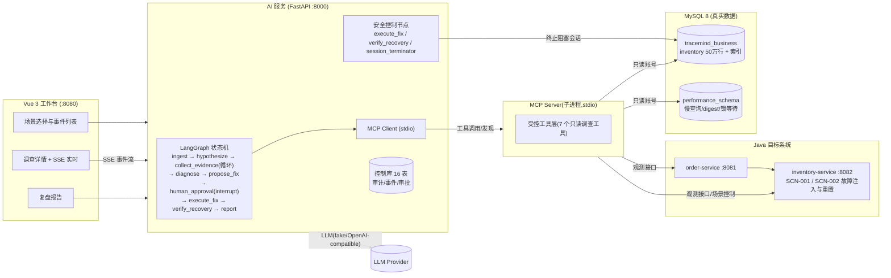

# TraceMind


面向微服务系统的 **AI 故障诊断与安全处置平台**:当微服务出现性能故障时,AI Agent 基于真实证据(MySQL 慢查询、执行计划、索引元数据、接口 P95、锁等待关系)自动完成 **根因定位 → 修复方案 → 人工审批 → 自动修复 → 恢复验证 → 复盘报告** 的完整闭环,全程可审计、可回放。支持**多故障场景**(SCN-001 缺索引 / SCN-002 锁等待)与**回归评测流水线**。

> 简历作品集项目 · 证据驱动的根因判定 + 人机协同的安全闭环 + 全链路审计

> **一句话**:基于 LangGraph 的 AI 故障诊断系统:证据驱动消除幻觉,多模型路由控成本,记忆+反思持续进化,评测平台量化验证改进。

---

## 核心功能一览

| 能力 | 说明 |
|---|---|
| 证据驱动诊断闭环 | LangGraph 状态机:假设→取证→根因→修复→审批→验证→复盘 |
| 双故障场景 | SCN-001 缺索引 / SCN-002 锁等待,真实 MySQL 证据 |
| 证据闸门防幻觉 | E1~E5/L1~L6 事实检查,根因必须证据确认 |
| 人工审批安全闭环 | 唯一写路径 + 过期拒绝 + KILL 执行前复核 |
| MCP 工具安全 | stdio→Streamable HTTP,最小权限隔离,全量审计 |
| 长期记忆 + 反思自改进 | qdrant 案例复用 + 失败负样本 + 3 轮重试 |
| 多模型路由 + 动态学习 | 节点级选模型 + ε-greedy,成本 ¥0.0153/次 |
| 量化评测平台 | 成功率/耗时/成本趋势,可视化验证改进 |
| 全链路审计与回放 | 每步决策/工具调用落库,SSE 事件流 + 只读 Replay |
| 真实可观测性 | Prometheus / Jaeger / OTel,证据来自真实系统 |
| Agent 进度可视化 | SSE 事件前端实时展示,节点级渐进呈现 |
| 评测触发 UI | 浏览器一键跑评测,结果自动入库出趋势 |

---

## 架构总览



### 关键设计

- **证据驱动的根因判定(双 Policy 闸门)**:SCN-001 缺索引走 E1~E5(接口 P95 → trace 定位数据库阶段 → 慢查询 digest → `EXPLAIN` 全表扫描 → 索引元数据缺失);SCN-002 锁等待走 L1~L6(锁等待关系 → 阻塞事务详情 → 阻塞者匹配 → 长事务 → 复合匹配 → 会话状态)。共享 Fact 派生双 Policy 状态(confirmed/refuted/unknown/stale),**证据齐备才确认根因**,证据矛盾或预算耗尽转人工。
- **人机协同的安全闭环**:Agent 只有只读调查能力;唯一写路径 `execute_fix`(预定义 DDL,六项校验)必须经过 `interrupt()` 挂起的**人工审批**,支持过期自动拒绝;锁场景处置 `TERMINATE_BLOCKING_SESSION` 经**会话终止执行器**(KILL 前复核:目标关系未变、仍持锁、账号白名单、非系统线程),负例零误杀、幂等防重复处置。
- **受控工具层(MCP 化)**:7 个只读调查工具封装为 **stdio MCP Server**(官方 SDK),LangGraph 通过持久化 MCP Client 完成工具发现与调用,消除进程内 direct 路径;`execute_fix` / `verify_recovery` 属确定性安全控制节点,不纳入 MCP。五账号隔离(业务读写 / 控制库 / 只读调查 / 仅 INDEX / 会话终止),Python 侧三连接池。
- **全链路审计与回放**:每次工具调用(含 transport / MCP 调用标识)、状态变化、审批决策、模型调用、知识检索全部落库,SSE 事件流按 `Last-Event-ID` 断线补发,复盘报告基于已落库事实生成。
- **真实数据而非模拟**:50 万行库存数据、真实 MySQL 执行计划与锁等待关系、真实 P95;故障由可逆的"删除/重建联合索引"与"后台长事务持锁/回滚"注入。

### Agent 智能

- **长期记忆**:诊断成功/失败案例向量化沉淀到 qdrant,`hypothesize` 时语义检索 top-k 复用历史经验;失败案例标记 `recovered=false` 作**避坑参考**,不重复失败路径;支持按保留期自动淘汰过期失败案例。
- **反思自改进**:修复失败后 `reflect` 节点结构化复盘(根因修正 / 证据缺口 / 新假设 / 策略调整),最多 3 轮重试;重试用尽转人工,完整反思链写 `reflection_log` 供复盘。
- **上下文压缩**:证据超阈值(8 条)自动摘要(EvidenceSummarizer),控制长链路 LLM 输入 token。
- **多模型路由 + 动态学习**:强推理节点(hypothesize / reflect)用 qwen3.8-max,高频工具节点(select_tool / report)用 qwen3.7-flash;窗口滚动评分按成功率 / 时延 / 成本加权自动选优,ε-greedy 探索/利用权衡,主模型故障自动切异厂商 fallback。

### 安全设计

- **唯一写路径 + 人工审批**:Agent 只有只读调查能力;`execute_fix`(预定义 DDL,六项校验)必须经 `interrupt()` 挂起的人工审批,支持过期自动拒绝。
- **会话终止复核**:锁场景处置 KILL 前复核 5 项(审批有效未过期 / 阻塞事务一致 / 仍持锁 / 账号白名单 / 非系统线程),负例零误杀、幂等防重复处置。
- **五账号最小权限隔离**:业务读写 / 控制库 / 只读调查 / 仅 INDEX / 会话终止,Python 侧三连接池;MCP 工具只读,Token 不进 Prompt/日志。

---

## 快速开始

### 方式一:Docker Compose 一键启动(推荐)

```bash
docker compose up -d --build    # MySQL(自动 initdb)+ seed(灌 50 万行)+ order + inventory + ai + web
docker compose ps               # 全部 healthy 后开始使用
```

工作台 `http://localhost:8080`;默认 `TRACEMIND_LLM_MODE=fake`(确定性回归可复现),真实模型验收见 V1.1 章节。

### 方式二:本地开发环境

```bash
# 1) 初始化数据库(需 root 密码)
powershell -ExecutionPolicy Bypass -File scripts/init-database.ps1
# 2) 灌入压测数据
powershell -ExecutionPolicy Bypass -File scripts/generate-data.ps1
# 3) 启动 Java 服务(inventory 需 DEMO_MODE)
java -jar order-service/target/order-service-0.1.0-SNAPSHOT.jar
DEMO_MODE=true DEMO_KEY=demo-secret-2026 java -jar inventory-service/target/inventory-service-0.1.0-SNAPSHOT.jar
# 4) 启动 AI 服务
cd ai-service && uv run uvicorn app.main:app --port 8000
# 5) 启动前端
cd web && npm run dev
```

## 演示流程(5 分钟)

### SCN-001:库存查询慢(缺联合索引)

```bash
python scripts/verify-m5.py --base http://localhost:8000 --order http://localhost:8081
```

自动执行:重置 → 健康负载 → 基线 → 注入故障(DROP INDEX)→ 调查(E1~E5 证据)→ 审批 → 建索引 → 恢复验证 → 复盘报告。

**诊断过程分解**:
1. `hypothesize` 生成假设:缺少联合索引 `idx_sku_warehouse`(RAG 检索 + 案例记忆辅助)
2. `collect_evidence` 证据闸门:E1(接口 P95 升高)→ E2(trace 定位数据库阶段)→ E3(慢查询 digest)→ E4(`EXPLAIN` 全表扫描)→ E5(索引元数据缺失),全部通过才确认
3. `propose_fix` 确定性生成建索引 DDL → `human_approval` 人工审批
4. `execute_fix` 执行建索引 → `verify_recovery` 验证 P95 回落与计划走索引

### SCN-002:库存预占超时(长事务持锁)

```bash
python scripts/verify-m13-scn002.py --base http://localhost:8000
```

自动执行:重置 → 健康负载 → 注入锁故障(后台长事务 `FOR UPDATE` 持锁 42/7)→ 调查(L1~L6 锁证据)→ 审批 → **KILL 阻塞会话** → 恢复验证 → 复盘报告。负载与锁验证并发执行,验证 `FOR SHARE` 被阻塞的真实锁等待。

**诊断过程分解**:
1. 假设:长事务持锁阻塞库存预占
2. 证据链:L1(锁等待关系)→ L2(阻塞事务详情)→ L3(阻塞者匹配)→ L4(长事务确认)→ L5(复合匹配)→ L6(会话状态),`X-NO-TARGET-LOCK-WAIT` 为可排除项
3. 处置:审批通过后经**会话终止执行器** KILL 阻塞会话(执行前 5 项复核)
4. 恢复验证:无锁等待 + 阻塞会话已终止 + P95 相对基线回落

前端工作台可切换场景、注入/重置故障、查看实时调查进度与审批。

## 目录结构

```
java/                 # Maven 多模块:common / order-service / inventory-service(故障注入)
ai-service/           # FastAPI + LangGraph + MCP Client + SQLAlchemy 三连接池(Agent 核心)
web/                  # Vue3 + TS + Vite + Element Plus 工作台(场景/详情/回放/评测)
knowledge/runbooks/   # RAG 知识库(慢 SQL / 锁等待手册,embedding 入 qdrant)
data/eval_cases/      # 离线评测 Fixture(24 条:16 索引 + 8 锁)
observability/        # Prometheus / Jaeger / Grafana 观测配置
scripts/              # 初始化/灌数/负载/验收/评测脚本
scripts/sql/          # 建库/五账号/DDL/版本化迁移
reports/              # 回归评测报告 + 评测平台数据
docs/                 # 设计文档(specs/plans)+ 面试 Q&A + 版本演进
compose.yml           # 一键编排(基底,本地/VM 统一)
```

## 测试与验收

```bash
cd java && mvn test               # JUnit5 + Mockito(单元)
cd java && mvn verify             # 追加 Testcontainers MySQL 集成测试(需 Docker,EXPLAIN 断言走索引)
cd ai-service && uv run pytest    # Agent 图/工具/MCP/API(436)
cd web && npx vitest run          # Vue 组件/组合式函数(46)
npx playwright test               # 浏览器 E2E 冒烟(演示闭环,需全栈运行)
python scripts/verify-m5.py --base http://localhost:8000           # SCN-001 全链路
python scripts/verify-m13-scn002.py --base http://localhost:8000   # SCN-002 全链路
python scripts/eval_agent.py --mode offline --llm fake --runs 1    # 24 条离线评测(fake)
python scripts/run_regression.py --tier fast                          # 回归流水线 fast 档
```

## 技术栈

| 层 | 技术 | 职责 |
|---|---|---|
| 目标系统 | Java 21 / Spring Boot 3.3 / MyBatis-Plus | order-service / inventory-service,故障注入与真实数据 |
| Agent 编排 | Python / FastAPI / LangGraph | 状态机诊断闭环,证据闸门,human-in-the-loop 审批 |
| 工具层 | MCP(官方 Python SDK) | stdio → Streamable HTTP 独立容器,7 只读调查工具 |
| 数据访问 | SQLAlchemy 2.0 / 三连接池 | 业务库 + 控制库 + 会话终止专用账号 |
| 前端 | Vue 3 / TypeScript / Vite / Element Plus | 工作台:场景/详情/审批/回放/评测/进度面板 |
| 数据库 | MySQL 8 / performance_schema / information_schema | 真实证据源:执行计划、慢查询、锁等待 |
| 向量检索 | Qdrant(embedding 1024 维) | 长期记忆:案例沉淀 + 语义检索 |
| 可观测性 | Prometheus / Jaeger / OTel / Grafana | 真实 P95 / trace,证据链数据源 |
| 实时通信 | SSE | 事件流:断线补发 + 前端实时进度 |
| 部署 | Docker Compose | 一键编排,本地 / VM 统一 |

## 简历亮点

**工程能力层**
- 用 LangGraph 状态机编排**证据驱动**诊断流程,以 E1~E5 / L1~L6 事实闸门替代 LLM 猜测式根因,消除幻觉;双 Diagnostic Policy 支持**多故障场景**(缺索引、锁等待)与冲突检测。
- 将**人工审批(human-in-the-loop)**嵌入 Agent 状态机,唯一写路径 + 前置校验 + 过期自动拒绝;**锁场景处置**对 KILL 做执行前复核(目标未变 / 仍持锁 / 账号白名单),负例零误杀,形成可对外宣讲的安全闭环。
- 工具层以 **MCP 协议标准化**(stdio → Streamable HTTP 独立容器,7 只读工具)与**最小权限隔离**落地(五账号/三连接池/白名单参数),每次工具调用与决策全量审计,支持复盘回放;配套**真实可观测性**(Prometheus / Jaeger / OTel)与 **SSE 实时 Agent 进度面板**。

**Agent 智能层**
- **长期记忆**:qdrant 案例向量沉淀 + 语义检索复用,历史诊断经验跨任务复用;**上下文压缩**(EvidenceSummarizer)控制长链路 token。
- **反思自改进**:修复失败 → 结构化复盘(根因修正 / 证据缺口 / 新假设 / 策略调整)→ 最多 3 轮重试;失败案例**负样本记忆**(避坑检索,不重复失败路径)。
- **多模型路由 + 动态路由学习**:强推理节点用大模型、高频工具节点用快模型;窗口滚动评分按成功率 / 时延 / 成本自动选优,数据驱动自适应。

**数据验证层**
- 后端 **436 个测试**、前端 **46 个测试**、**24+ 条离线评测**、SCN-001 / SCN-002 **真实模型验收**通过。
- 成本量化:多模型路由后**单次诊断成本 ¥0.0153**(真实模型实测)。
- **评测平台可视化**:成功率 / 耗时 / 成本趋势,量化验证每次改进有效(记忆 / 反思 / 路由的改进都有评测记录佐证)。

## 成果与数据

| 指标 | 数值 | 说明 |
|---|---|---|
| 后端测试 | 436 | Agent 图/工具/MCP/API/记忆/路由/评测 全量 pytest |
| 前端测试 | 46 | Vue 组件 / 组合式函数 vitest |
| 离线评测 | 24+ | 16 索引 + 8 锁 fixture,动态 N/N |
| 真实模型验收 | SCN-001/002 PASS | qwen 系列真实模型,证据链闭环 |
| 单次诊断成本 | ¥0.0153 | 多模型路由后实测(qwen3.8-max + qwen3.7-flash) |
| 故障场景 | 2 | 缺索引 / 锁等待,真实 MySQL 证据 |
| 版本演进 | 16 | V1.0-V1.16,每版 spec + plan + 测试 |

## 路线图

- **多 Agent 协作**:Planner / Worker / Reviewer 多角色,任务分解、并行调查、交叉审查(单 Agent 能力储备已就绪)
- **更多故障场景**:缓存失效 / 连接池耗尽 / 网络超时等,扩展评测覆盖面
- **LLM 流式输出**:推理过程 token 级实时呈现(当前为节点级)

## 版本历史

- **V1.0**:核心闭环(Java 目标系统 + LangGraph 单场景 + 人工审批 + 真实 MySQL 证据)
- **V1.1**:真实 LLM(三模式)+ Tool Calling + Runbook RAG + 离线/检索/真实模型三级评测
- **V1.2**:工具层 MCP 化(stdio,消除 direct 路径)
- **V1.3**:多故障场景 SCN-002 锁等待 + 双 Policy 诊断 + 处置安全 + 回归评测流水线
- **V1.4**:真实可观测性(OTel Agent + Prometheus + Jaeger + Grafana)+ 观测审计 + 回归强制真实后端
- **V1.5**:证据与决策链回放(调查时不可变快照 + 只读 Replay API + 前端回放页)+ Run 级版本冻结与恢复前校验
- **V1.6**:正式迁移器 + Run Profile fail-closed + 离线评测缺陷修复(fixture trace_id 契约)
- **V1.7**:MCP Streamable HTTP 远程传输与服务化(独立容器、标准传输、token 认证、两段式审计)
- **V1.8**:Agent 运行观测面板 + 量化评测报告(成功率/耗时/tokens)
- **V1.9**:长期记忆(qdrant 案例沉淀 + 语义检索复用)+ 上下文压缩(EvidenceSummarizer)
- **V1.10**:反思自改进(reflect 结构化复盘 + 3 轮重试)+ 失败案例负样本记忆(避坑检索)
- **V1.11**:多模型路由(节点级选模型)+ 成本统计(单次诊断 ¥0.0153)+ 容灾 fallback
- **V1.12**:动态路由学习(窗口滚动评分:成功率/时延/成本加权)
- **V1.13**:评测平台可视化(eval_run 持久化 + 前端列表/详情/趋势)
- **V1.14**:Agent 进度面板(SSE 事件前端实时展示,节点级渐进可视化)

> 各版本详细技术说明见 [docs/changelog.md](docs/changelog.md)

## 文档

- [各版本设计文档](docs/superpowers/specs/)
- [版本演进详细说明](docs/changelog.md)
- [面试 Q&A](docs/interview-qa.md)
